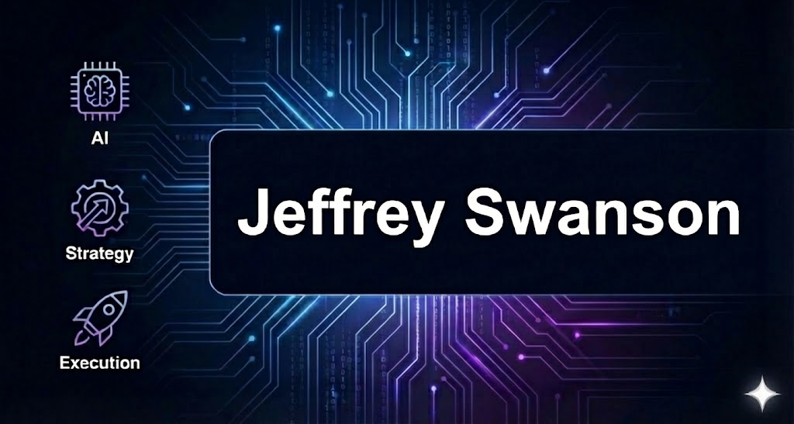

  

 

## My name's Jeff 👋

Most of my work is practical: real code, first principles, and working examples. I focus on helping technical PMs move beyond prompt engineering to understanding the architecture behind autonomous systems.

I'm currently publishing an open curriculum on **Agentic AI from Scratch**—complete modules with code you can clone, run, and learn from.

### What I'm Building

- **AI Agent Fundamentals**: interaction loops, system prompts, tool use, reasoning patterns
- **Ready-to-run modules**: clone → install → run
- **RAG & Memory**: context management, knowledge bases, retrieval patterns
- **Multi-agent systems**: orchestration, planning, guardrails
- **Practical workshops**: built for PMs who want to understand the tech, not just manage it

### About Me

📍 Based in Stockholm. I've worked in product and engineering roles at companies ranging from big tech to small startups. Currently helping secure the internet.

🌱 Likes: Agentic AI, home automation, books, espresso, and side projects that my agents are helping me finally finish.

  

